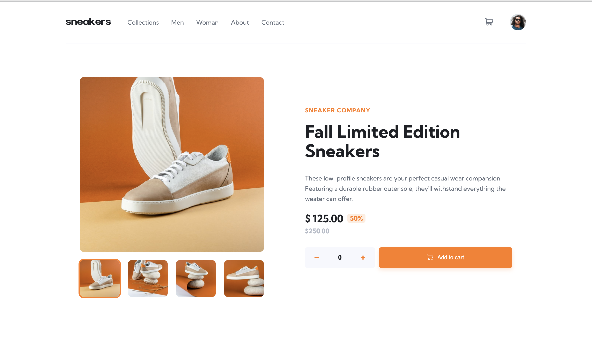
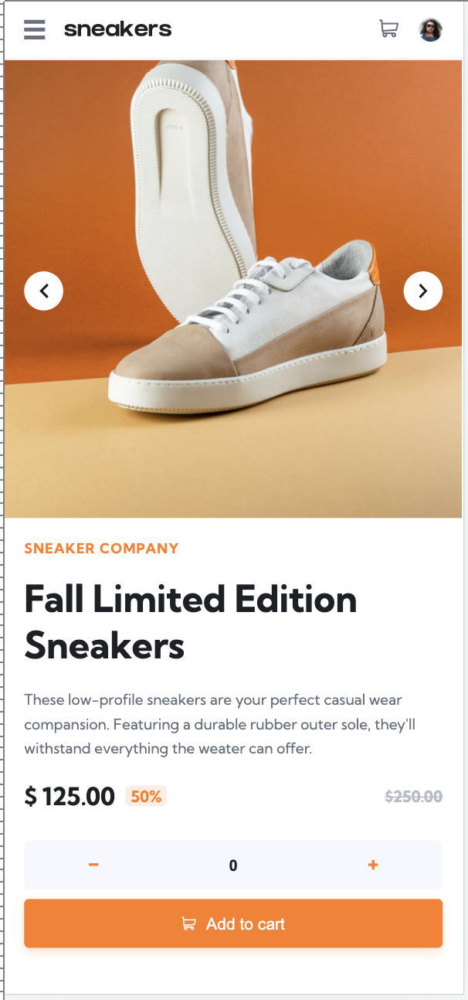

# E-commerce product page

## Welcome! 👋

Thanks for checking out my implementation for this front-end coding challenge.
Please keep on reading if you are interested of my approach and structure.
I did not refactor my code much, what I will update the following weeks. I just wanted to make the product page run well. The code is raw and not bundled or compressed.

The challenge is done by a desktop-first approach.

## Building the project

Building this small project I chose to write a short user storie and feature list, that could build up into a bigger application.

The project is written in SASS to have the best structured outcome for future progressions on the web app.

Possiblities to improve are to display all the data coming froma json format, so the products are loaded dynmaically and easier to change and maintain.

## Deploying your project

You can preview the project with this link!

- [GitHub Pages](https://benchis.github.io/ecommerce_product_page/)

## Experience on the project

My biggest concern on the Project that I have to try out is if the swiping functionality for the image gallery works in the mobile version.
I think my solutio is not the cleanest one, but as intended the goal was to make this app responsd well to all screen sizes and make the functionality work.

What really took me some time to understand was how I could make the mobiel gallery swipe work the way I was already writing the markup. I could have changed tha markup again position the elements absolute next to each other hide the overflow and use a transform property to let them slide in when an event is triggered by pressing the icons.
